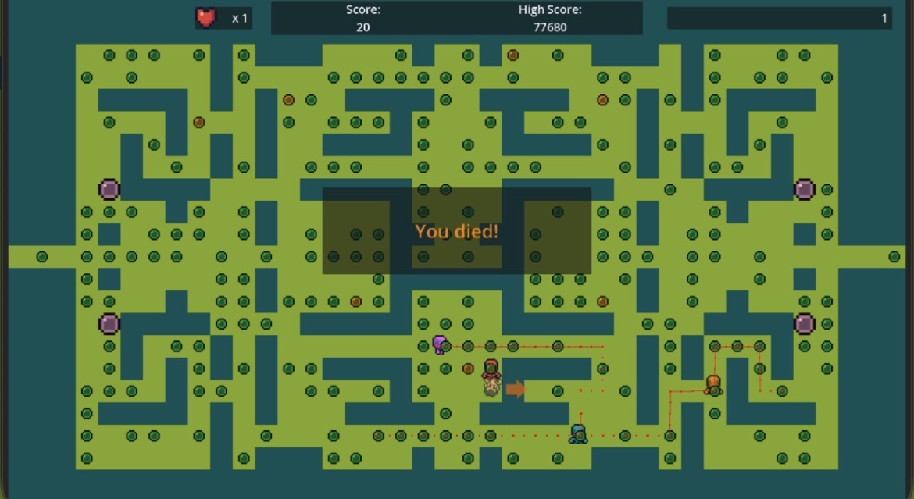
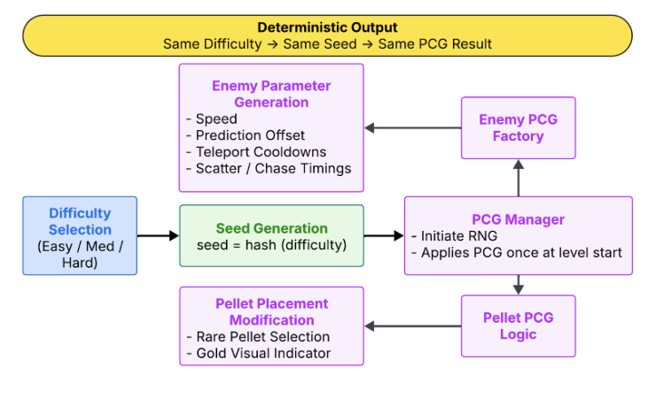
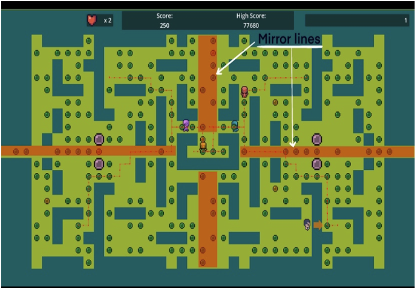
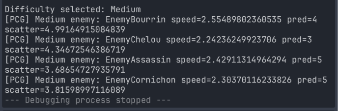
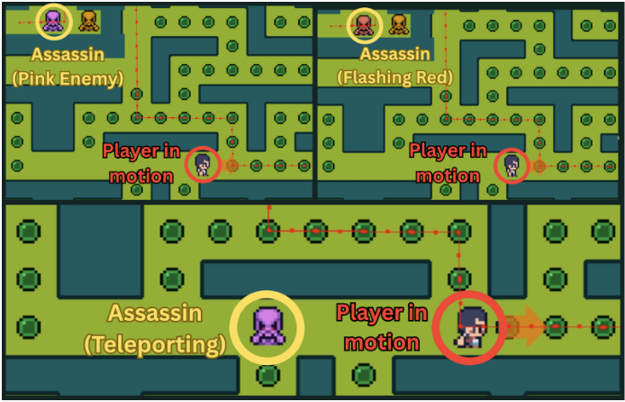
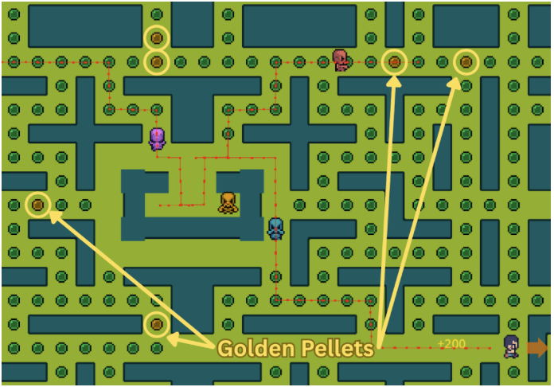

# Procedural Content Generation in a Pac-Man Style Game

## Overview

This project extends a Pac-Man style arcade game with a set of **procedural content generation (PCG) systems** designed to improve replayability while preserving the clarity and pacing of classic arcade gameplay. Instead of replacing the original mechanics, the project introduces controlled procedural variation across multiple gameplay systems so that each run feels slightly different while remaining balanced and readable.

The procedural systems influence several aspects of gameplay including **maze topology, enemy behavior, power-up distribution, and temporary gameplay effects**. All procedural decisions are initialized once at the start of each run using seeded randomness derived from the selected difficulty level. This ensures reproducible outcomes for testing and debugging while still producing meaningful variation across playthroughs.

The project was implemented using the **Godot Engine** and builds upon the open-source Pac-Man clone **zep-man**.

---

## Gameplay Demonstration

A gameplay video demonstrating the procedural systems can be added here.


[](media/gameplay_demo.mp4)

The gameplay demonstration should highlight the following features:

- Procedural maze generation at level start  
- Enemy behavior differences across runs  
- Rare pellet pickups and temporary buffs  
- Assassin teleportation mechanics  

---

## System Architecture

The procedural framework is organized around a **central PCG Manager** responsible for initializing and coordinating all procedural systems. When a run begins and the player selects a difficulty level, the PCG Manager generates the parameters that influence maze structure, enemy behavior, and collectible placement.

These systems operate independently but are seeded from the same difficulty-based random seed to ensure deterministic procedural outcomes.

<p align="center">

</p>

Core procedural components include:

- Maze topology generation  
- Enemy behavior parameter mutation  
- Rare pellet distribution  
- Temporary gameplay buffs  
- Difficulty-based seeded randomness  

---

## Procedural Maze Generation (Spanning Tree Algorithm)

The most significant procedural system implemented in this project is the **maze generation algorithm**, which produces new maze layouts at the start of each run. The maze is generated using a **randomized spanning tree algorithm applied to a grid graph representing walkable tiles**. This guarantees that the maze remains fully connected, preventing isolated regions and ensuring that all corridors and pellets remain reachable.

To preserve the structural symmetry characteristic of Pac-Man style levels, generation occurs only within the **top-left quadrant** of the map. Once a valid maze structure is produced, the quadrant is mirrored horizontally and vertically to construct the complete maze layout. This approach reduces computational complexity while maintaining predictable spatial patterns that players can quickly learn.

Key properties of the maze generator:

- Graph-based maze generation using a **spanning tree**
- Guaranteed **full connectivity of walkable tiles**
- Quadrant generation followed by **horizontal and vertical mirroring**
- Structural constraints preventing walls on mirror axes
- Balanced corridor density to preserve arcade-style navigation

<p align="center">

</p>

---

## Procedural Enemy Behavior

Enemy behavior is varied using a **parameter mutation system** that modifies several behavioral properties at the beginning of each run. Rather than introducing entirely new enemy mechanics, the system alters parameters within controlled ranges to create subtle variations in how enemies pursue and intercept the player.

Procedurally generated parameters include:

- Base movement speed  
- Scatter and chase phase timing  
- Frightened state duration  
- Player prediction offset  
- Spawn delay  
- Direction change cooldown  

These variations significantly influence enemy movement patterns and interception behavior while maintaining the recognizable characteristics of each enemy archetype.

<p align="center">

</p>

---

## Assassin Teleportation System

A specialized enemy type called the **Assassin** introduces positional disruption through a teleportation mechanic. Unlike traditional pursuit-based enemies, the Assassin periodically disappears and reappears near the player, creating sudden moments of pressure without relying solely on speed advantages.

Teleportation behavior is governed by several procedural parameters:

- Teleport cooldown interval  
- Minimum and maximum teleport radius  
- Warning duration before teleportation  

To maintain fairness, several constraints are applied:

- Teleport destinations must be **valid walkable tiles**
- Teleports occur **behind the player's movement direction**
- A short visual warning appears before teleportation

These constraints ensure that teleportation increases tension without becoming unpredictable or unfair.

<p align="center">

</p>

---

## Rare Pellet System

The pellet system was expanded by introducing **rare golden pellets**, which are procedurally selected from the existing pellet set at the beginning of each level. Rather than creating new objects in the level, the system upgrades a subset of standard pellets into rare variants.

Rare pellet counts scale with difficulty:

| Difficulty | Rare Pellets |
|------------|-------------|
| Easy | 10 |
| Medium | 5 |
| Hard | 2 |

Although the number of rare pellets varies by difficulty, the **total score obtainable from rare pellets remains constant**, concentrating rewards into fewer pickups at higher difficulty levels.


<p align="center">

</p>

---

## Temporary Buff System

Collecting a rare pellet temporarily alters gameplay dynamics by granting the player a speed boost while simultaneously slowing enemies. These effects are intentionally short-lived so they introduce bursts of momentum without permanently altering the game’s balance.

Buff durations vary by difficulty:

| Difficulty | Buff Duration |
|------------|--------------|
| Easy | 15 seconds |
| Medium | 10 seconds |
| Hard | 5 seconds |

This design creates brief opportunities for aggressive movement while preserving the tension and pacing of the core gameplay loop.

---

## Seeded Randomness

All procedural decisions in the system are derived from a **deterministic random seed** generated from the selected difficulty level.

```python
seed = hash(difficulty)
```

## Evaluation

Playtesting demonstrated that even small procedural variations can significantly affect gameplay routes and player decision-making. Changes in enemy speed, pellet placement, and maze structure influence how players navigate the maze while still preserving the familiar pacing and mechanics of classic Pac-Man gameplay.

The **spanning tree maze generation algorithm** proved particularly effective at maintaining maze connectivity and readability while introducing meaningful structural variation between runs. Because the maze remains fully connected and symmetrical, players can still develop spatial awareness even as layouts change.

Enemy parameter variation and rare pellet placement also introduce noticeable differences in pacing. Some runs encourage aggressive enemy interception, while others create opportunities for strategic pellet collection and evasive movement.

## Credits
This project builds upon the open-source Pac-Man clone:

**zep-man**  
https://github.com/AlixBarreaux/zep-man

Original author: **Alix Barreaux**

Procedural content generation systems and gameplay extensions were implemented by:

- Tapiwa Chibwe  
- Ajay Ludher